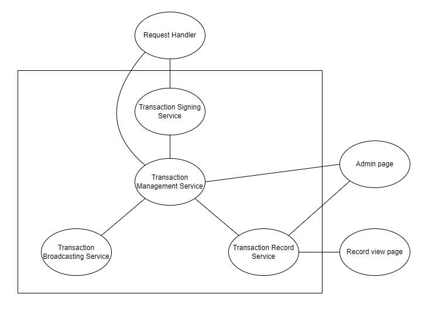

# Designing a Transaction Broadcaster Service

The Transaction Broadcaster Service:
- Receives transaction requests, eventually returning either HTTP `200`, or HTTP `400` - `500`.
- Signs the request data
- Broadcasts the signed transaction to an EVM-compatible blockchain network
- Provides visibility on the status of the transactions. 

Additional requirements for the system:
- If the broadcaster service restarts unexpectedly, any pending transaction should still be fulfilled.
- Admins should be able to retry a failed broadcast at any point in time.


The Transaction Broadcaster Service can be composed of several microservices:

1. **Request Handler**: The request handler is responsible for receiving incoming transaction requests through the `/broadcast_transaction` endpoint. It performs request validation and authentication, ensuring that the parameters and format are correct. If the request is valid, it forwards the request to the Transaction Signing Service.

2. **Transaction Signing Service**: This microservice is responsible for signing the transaction data. It securely stores the private key required for signing transactions and uses it to generate a signed transaction. Once the transaction is signed, the Transaction Signing Service forwards the signed transaction to the Transaction Management Service.

3. **Transaction Management Service**: This microservice is responsible for managing new and unsuccessful transactions and initiating automatic retries. It maintains a persistent queue of transactions to be sent to the Transaction Broadcasting Service. It interacts with the transaction signing, broadcasting, and record services, keeping track of failed transactions, stores the necessary details to recreate and retry broadcasts, and provides an interface for administrators to view and trigger retries manually.

4. **Transaction Broadcasting Service**: This microservice connects to the EVM-compatible blockchain network and broadcasts the signed the transaction by sending an RPC request to a blockchain node. It handles the various response scenarios from the blockchain node. It determines the success or failure of the transaction broadcast and returns the status back to the Transaction Management Service.

5. **Transaction Record Service**: This microservice is responsible for managing and providing the transaction data and status. It maintains a database of all transactions and their statuses, categorizing them as either `passed`, `failed`, or `pending`. It provides a status page where users and administrators can view the list of transactions and their details.

The diagram below depicts this system, with the lines representing interactions between different elements of the system: 



## Process

1. Request Handling:
   - The Transaction Broadcaster Service exposes an internal API that receives transaction requests.
   - Upon receiving a request, the service validates the request parameters and format.
      - If the request is valid, the service proceeds to forward the request body to the transaction signing service
      - If the request in invalid, a HTTP `4XX` error code is sent back to the client in response, and no further processing happens on the request

2. Transaction Signing:
   - The transaction service securely stores the private key required for signing transactions.
   - Upon receiving the transaction data, the service uses the private key and the data to generate a signed transaction.
   - The signed transaction might for example be in the following format:
      ```
      {
      "jsonrpc": "2.0",
      "id": 2,
      "result": {
         "raw": "0xf88380018203339407a565b7ed7d7a678680a4c162885bedbb695fe080a44401a6e4000000000000000000000000000000000000000000000000000000000000001226a0223a7c9bcf5531c99be5ea7082183816eb20cfe0bbc322e97cc5c7f71ab8b20ea02aadee6b34b45bb15bc42d9c09de4a6754e7000908da72d48cc7704971491663",
         "tx": {
            "nonce": "0x0",
            "maxFeePerGas": "0x1234",
            "maxPriorityFeePerGas": "0x1234",
            "gas": "0x55555",
            "to": "0x07a565b7ed7d7a678680a4c162885bedbb695fe0",
            "value": "0x1234",
            "input": "0xabcd",
            "v": "0x26",
            "r": "0x223a7c9bcf5531c99be5ea7082183816eb20cfe0bbc322e97cc5c7f71ab8b20e",
            "s": "0x2aadee6b34b45bb15bc42d9c09de4a6754e7000908da72d48cc7704971491663",
            "hash": "0xeba2df809e7a612a0a0d444ccfa5c839624bdc00dd29e3340d46df3870f8a30e"
         }
      }
      }
      ```
   - The signed transaction is then passed to the transaction management service.

3. Transaction Broadcasting:
   - Upon receiving this new transaction, the transaction management service adds the transaction to the queue and makes a call to the transaction record service to add it to the record with the status `pending`.
   - When the transaction reaches the front of the queue, it is sent to the transaction broadcasting service.
   - The service sends the signed transaction as an RPC request to the blockchain node.
   - The broadcaster service handles different response scenarios from the blockchain node:
     - If the blockchain node responds with a success code within 20-30 seconds, the transaction is considered successful. The successful response is sent to the transaction management service
     - If the blockchain node fails to respond within 30 seconds, the broadcaster terminates the request and sends a failure response to the transaction management service.
     - If the blockchain node responds with a failure code, the broadcaster sends a failure response to the transaction management service

4. Retry Mechanism:
   - The Transaction Management Service includes a retry mechanism for failed transactions.
   - Upon receiving a success response from the Transaction Broadcasting Service, the Transaction Management Service interacts with the Transaction Record Service to update the status of the transaction to `passed`. A HTTP `200` response is sent back to the client to indicate that the transaction was successful.
   - Upon receiving a failed response from the Transaction Broadcasting Service, the Transaction Management Service adds the transaction back into the queue to be retried.
      - The service keeps track of the number of retries. After the specified number of unsuccessful retries, the Transaction Management Service interacts with the Transaction Record Service to update the status of the transaction to `failed`. A HTTP `4XX` response is sent back to the client to indicate that the transaction was unsuccessful.
   - Administrators can also view the list of failed transactions and manually trigger a retry, which would cause the transaction to be recreated and re-signed and added to the queue by the Transaction Management Service.

5. Transaction Status Page:
   - The Transaction Broadcaster Service provides a status page that displays the list of transactions.
   - The status page categorizes transactions as either passed or failed based on their broadcast status.
   - Each transaction entry includes relevant details such as the transaction ID, message type, data, and broadcast status.
   - The page should update dynamically to reflect the latest transaction statuses.
   - Additionally, the status page may include additional information such as timestamps, block confirmation details, and any error messages received from the blockchain network.

### Unexpected Restart

In the event of an unexpected restart, the transaction queue and record remains, hence the transactions can continue being processed. The service should automatically resume its operations after restarting and the pending transactions will still be fulfilled.